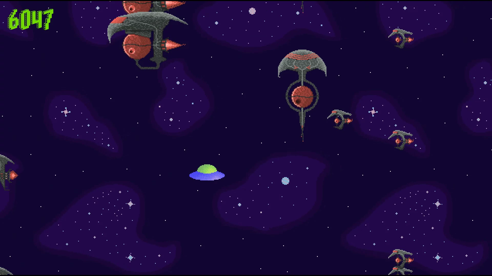

# PixUfo

Enjoy the cosmic weightlessness and avoid enemies in a 2D space.



## What so special?

Author's weightlessness steering - realistic movement and space-like steering created from scratch.

## Purpose

Make the game by learning C++ and random framework. In this case - SDL2.

## Warning

**As it's the past educational project, may contain low quality code.**

## Requirements

- at least HD display resolution,
- 64-bit OS: Windows, GNU/Linux or macOS,
- [development-only] g++ (gcc with libstdc++) with version >= 4.8.1.

## Gameplay

**Goal:** avoid the Nebulas (grey-red vechicles) by steering the Ufo using arrows. Note that there is no gravity. Menu buttons confirmation is done by clicking enter key and pausing the game by escape key. Unfortunately changing the system resolution with the game opened may break it's rendering.

## Disclaimer

Works well on Linux. On Windows some fonts are blended and Nebulas (enemies) position randomization doesn't work. Really don't know why. Crashes on macOS.

## Building a project

### Linux-based OS (TL:DR for Ubuntu)

```shell
sudo apt update &&
sudo apt install git git-lfs gcc g++ make libsdl2-dev libsdl2-ttf-dev &&
git clone https://gitlab.com/mattmaniak/pixufo.git &&
cd pixufo &&
make &&
./PixUfo
```

### macOS with Homebrew

```shell
brew update &&
brew install git git-lfs gcc g++ make sdl2 sdl2_ttf &&
git clone https://gitlab.com/mattmaniak/pixufo.git &&
cd pixufo &&
make &&
./PixUfo
```

### Windows (example for cmd.exe - 64-bit only for now)

1. Install the compilation environment choosing "TDM-GCC Recommended, C/C++".
[TDM-GCC](http://tdm-gcc.tdragon.net/)

2. Clone the repository with Git and enter it's directory.

3. Download SDL2 development libraries.
[SDL2-devel-2.0.*-mingw.tar.gz](https://github.com/libsdl-org/SDL/releases)
[SDL2_ttf-devel-2.0.*-mingw.tar.gz](https://github.com/libsdl-org/SDL_ttf/releases)
Extract the `SDL2-devel-2.0.*-mingw.tar.gz` to `SDL2-devel-2.*.*-mingw.tar` and then to a normal directory. Copy the `x86_64-w64-mingw32` and paste it to Your's TDM-GCC-64 installation directory.
Asterisk sign is the placeholder for minor and patch version numbers. They can be vary between.

4. Compile and run.

``` shell
cd [pixufo_directory]
mingw32-make
PixUfo.exe
```

### Remove object files

#### GNU/Linux and macOS

```shell
make clean
```

#### Windows

```shell
mingw32-make clean
```

## Development

Coding style is [Google C++ Style Guide](https://google.github.io/styleguide/cppguide.html). Except of indentation which is four spaces instead of two spaces and brace style which is [Allman](https://en.wikipedia.org/wiki/Indentation_style#Allman_style) instead of One True Brace Style.
